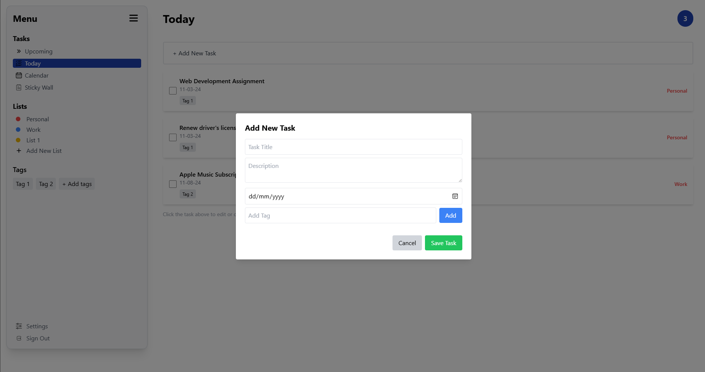
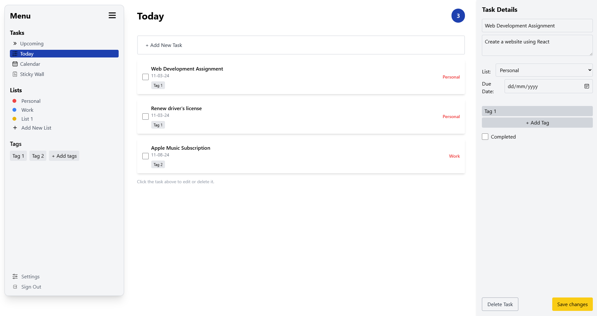

# To-Do List Web Application

  

This is a simple and interactive front-end web application for managing your tasks efficiently. Users can add, edit, and delete tasks seamlessly. The project is built with React.js and styled using Tailwind CSS for a clean and modern user experience.

## Features

- **Add Tasks**: Quickly add new tasks to your to-do list.
- **Edit Tasks**: Update task details with ease.
- **Delete Tasks**: Remove completed or unnecessary tasks.
- **Responsive Design**: Fully optimized for different devices and screen sizes.

## Technology Stack

- **Frontend**: React.js
- **Styling**: Tailwind CSS

## Installation

1. Clone the repository:
   ```bash
   git clone https://github.com/yourusername/your-repo-name.git
   ```
2. Navigate to the project directory:
   ```bash
   cd your-repo-name
   ```
3. Install dependencies:
   ```bash
   npm install
   ```
4. Start the development server:
   ```bash
   npm start
   ```
5. Open your browser and navigate to `http://localhost:3000`.

## Usage

1. Add new tasks using the input field and "Add" button.
2. Edit tasks by clicking the edit button next to a task.
3. Delete tasks by clicking the delete button next to a task.
4. Enjoy a smooth and intuitive task management experience!

## Project Structure

```
├── public
├── src
│   ├── components   # Reusable React components
│   ├── pages        # Page-level components
│   ├── App.js       # Main app file
│   ├── index.js     # Entry point
├── tailwind.config.js # Tailwind CSS configuration
├── package.json      # Project metadata and dependencies
```

### Screenshots

#### Dashboard


#### Add new Task


#### Edit or Delete Task


---

## Contributing

Contributions are welcome! If you have ideas for improvement or want to fix an issue, please fork the repository and submit a pull request.

## License

This project is licensed under the [MIT License](LICENSE).

---

**Contact**

For questions or feedback, feel free to reach out to [your-email@example.com](mailto:your-email@example.com).
